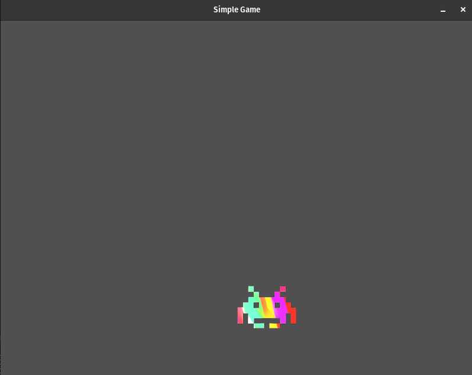

# Simple Game



*   **`simple-game/`**: Root directory containing all project files.
*   **`CMakeLists.txt`**: Modern CMake build script.
*   **`.gitignore`**: Standard ignore file for C/CMake projects.
*   **`include/`**: Contains all header files (`engine.h`, `renderer.h`, `input.h`, `game.h`), defining the public interface for each module.
*   **`src/`**: Contains all implementation files (`main.c`, `engine.c`, `renderer.c`, `input.c`, `game.c`) and the HTML shell for WASM builds.

The code adheres to the principles of simplicity and modularity, with the `Engine` struct acting as a central context to avoid global state.

# Native Build

## Prerequisites
- C compiler (GCC or Clang)
- CMake

## Build Steps
```bash
# 1. install dependencies: raylib
cd vendor/raylib/build
cmake -DBUILD_SHARED_LIBS=ON ..
make
sudo make install
sudo ldconfig

# 2. compile project (from the root dir)
mkdir build
cd build
cmake ..
make

# 3. Run
./simple-game
```

# 2. WebAssembly (WASM) Build

## Prerequisites
- Emscripten SDK (`emsdk`) installed and activated (e.g. `source ./emsdk_env.sh`)

## Build Steps
```bash
# 1. compile dependencies for wasm: raylib
cd vendor/raylib
emcmake cmake . -B build

# 2. Configure the project using the emcmake wrapper and compile
mkdir simple-game/build-web
cd simple-game/build-web
emcmake cmake .. -DWASM_BUILD=ON
make

# 3. Run a local web server to host the files
python3 -m http.server 8000 
```
